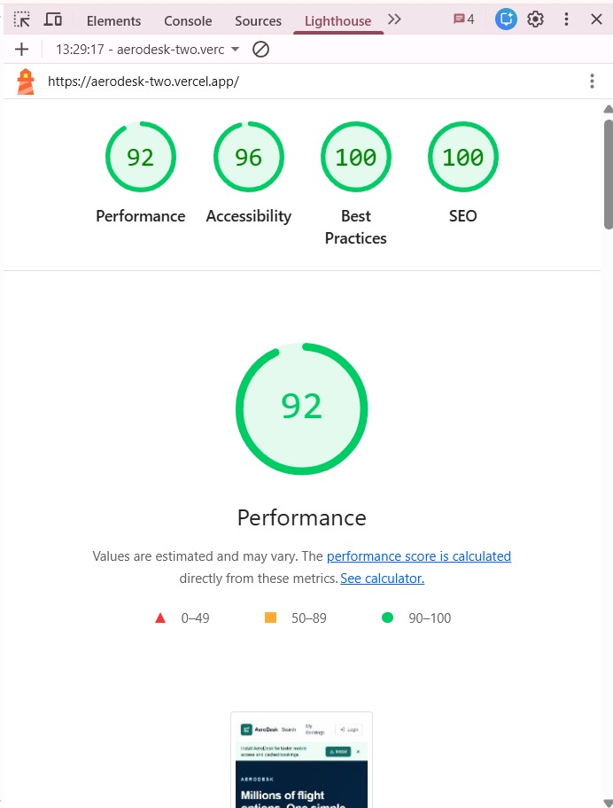
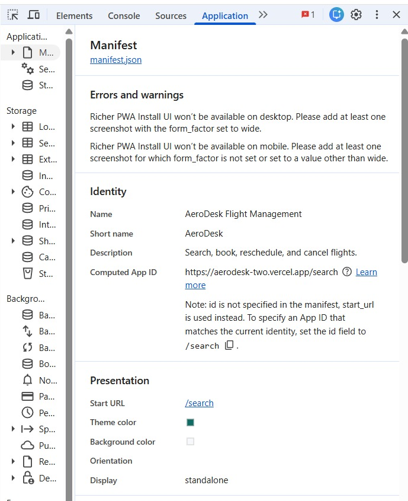
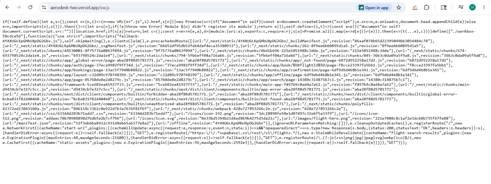
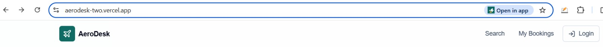

# AeroDesk Flight Management PWA

Flight Management web app for the internship assignment. It uses Next.js App Router, Supabase Auth/Postgres/Realtime, Zustand with persisted stores, Tailwind CSS, and `next-pwa`.

Production deployment: https://aerodesk-two.vercel.app

GitHub repository: https://github.com/Himansh-Harbola/aerodesk

## Features

- Search flights by origin, destination, date, and passenger count.
- Results with fare, duration, status, aircraft type, class-aware seat pricing, sorting, and pagination.
- Booking flow with passenger details, visual seat map, optimistic seat selection, and a dedicated PNR confirmation page.
- Supabase Realtime subscription on `seats` for live availability updates.
- My Bookings page with status badges, date-filtered reschedule picker, reschedule confirmation, cancellation confirmation, mobile bottom-sheet dialogs, and offline cached visibility.
- PWA manifest, install banner, offline fallback page, and caching rules for flight search/static assets.

## Local Setup

1. Install dependencies:

```bash
npm install
```

2. Copy environment variables:

```bash
cp .env.example .env.local
```

3. Create a Supabase project and paste the project URL and anon key into `.env.local`.

4. Run the SQL files in `supabase/migrations` in order. They create tables, RLS policies, triggers, RPCs, and seed flights/seats. The later migrations add the safer reschedule RPC, more future reschedule options, and a six-month daily route network.

5. Create a Supabase Auth test user:

```text
email: demo@aerodesk.test
password: DemoPass123!
```

6. Start the app:

```bash
npm run dev
```

The app includes demo fallback data if Supabase env vars are missing, so the responsive UI can still be reviewed locally.

## Supabase Notes

- `reserve_seat` locks the selected `seats` row with `FOR UPDATE`, rejects unavailable seats, marks the seat unavailable, inserts the booking, and inserts passenger data in one transaction.
- `cancel_booking` updates booking status and frees the seat inside a single RPC. The `bookings_reject_late_cancellation` trigger blocks cancellations within two hours of departure at DB level.
- `reschedule_booking` only allows same-route flight changes, prefers the same seat number on the new flight, falls back to another available same-class seat, frees the old seat, locks the new seat, and charges the difference when the new flight is more expensive.
- RLS is enabled on all tables. Users can read and mutate only their own booking-related rows. Flights and seats are public read models.
- `202605230006_six_month_daily_network.sql` creates one scheduled flight per day for every directed airport pair already present in the flight table. With the current five airports, that is 3600 generated flights and full seat maps.
- `202605230007_reschedule_seat_fallback.sql` improves rescheduling by automatically assigning another available seat if the original seat number is occupied on the new flight.

## Architecture and Tradeoffs

See [docs/ARCHITECTURE.md](docs/ARCHITECTURE.md) for the system design, data flow, RPC design, Zustand structure, PWA notes, and tradeoffs.

## Incomplete Features and Future Scope

See [docs/INCOMPLETE_FEATURES.md](docs/INCOMPLETE_FEATURES.md) for the intentionally placeholder travel-product buttons and the roadmap for hotels, cars, nearby airports, direct-flight filtering, flexible search, and admin tooling.

## Zustand Store Structure

- `useFlightStore`: search query, selected flight, selected seat, current booking step, and passenger form data. It persists search and in-progress booking state.
- `partialize` intentionally clears `passport_no` before persistence so sensitive passport numbers never land in localStorage.
- `useUserStore`: session token and cached bookings. Only the session token is persisted through Zustand; bookings are also mirrored to a lightweight browser cache so the My Bookings page can show the last known trip list offline.
- `resetBooking` is called after successful booking cancellation and after booking completion.

## PWA

`next-pwa` is configured in `next.config.mjs`:

- `StaleWhileRevalidate` for Supabase flight search REST calls.
- `CacheFirst` for static assets.
- `/offline` document fallback.
- Manifest includes 192x192 and 512x512 icons, standalone display, and theme color.

## Lighthouse and PWA Evidence

Chrome Lighthouse audit on the deployed URL:



PWA manifest:



Generated service worker:



Install prompt / open in app:



## Tradeoffs

- Supabase Auth test users are documented instead of being inserted through SQL, because Supabase Auth user creation is normally handled through the Auth admin UI/API rather than ordinary public-table seed SQL.
- Chrome 148 no longer shows a separate PWA category in Lighthouse; PWA evidence is included through the manifest, generated service worker, and installability screenshots above.
